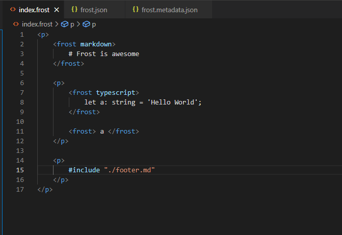
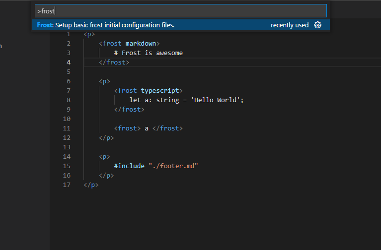

# Frost Extension for VS Code

## Features

- [x] Basic frost linting.
- [x] Snippets for frost syntax.
- [x] JSON Validations for frost configuration files.
- [ ] Linting for embedded languages (typescript, markdown).

## Commands

- Frost: Setup basic frost initial configuration file.

 

